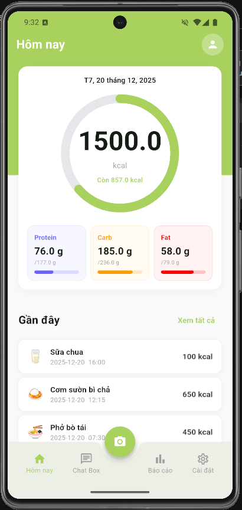
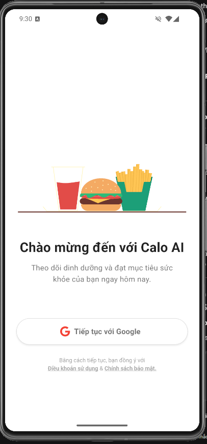
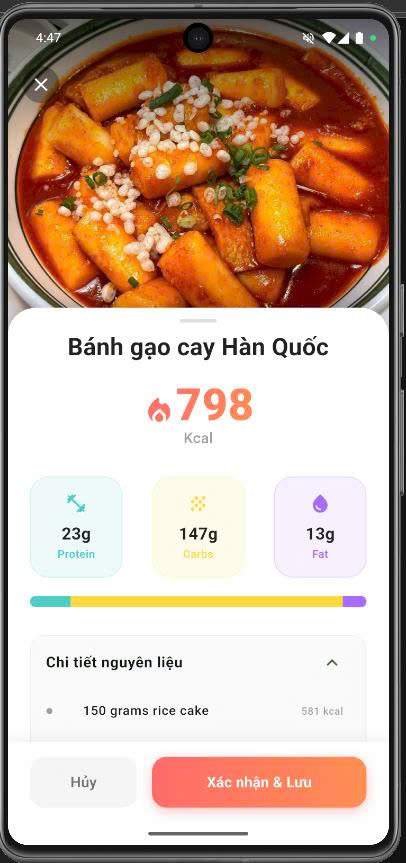
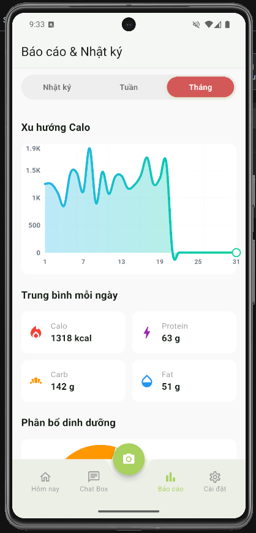
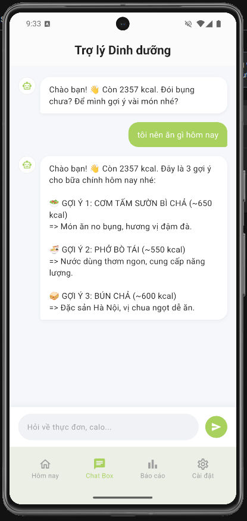
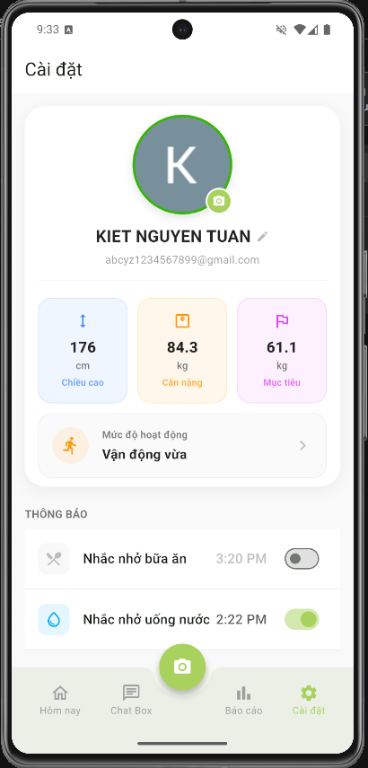

# 🥗 Calo AI - Smart Nutrition Tracking & Calorie Counting App


**Calo AI** is a comprehensive health tracking solution that solves the "data entry fatigue" problem by leveraging **Generative AI** to identify food from images and automatically calculate precise nutrition facts.

## 📸 App Screenshots

### 1. Core Flow: From Dashboard to AI Analysis

| Dashboard | Login | AI Analysis Result |
|:---:|:---:|:---:|
|  |  |  |

### 2. Health Management & Virtual Assistant

| Reports & Charts | AI Nutrition Chat | User Profile Setup |
|:---:|:---:|:---:|
|  |  |  |

## ✨ Key Features

### 1. 🤖 AI Food Recognition (AI Vision)
- Automatically analyzes food photos using **Google Gemini Pro Vision**.
- Identifies dish names (Vietnamese/English) and extracts detailed ingredient lists (English).
- Filters out non-food objects (cars, animals, documents...) to ensure accuracy.

### 2. 🥗 Precise Nutrition Calculation
- Connects with **Edamam Nutrition API** to convert ingredients into nutritional values:
  - Calories (Kcal)
  - Protein
  - Carbs
  - Fat
- **Smart Fallback Mechanism:** Automatically switches between **Batch Mode** (sending the whole list) and **Individual Mode** (sending item by item) to ensure data retrieval even when API limits occur.

### 3. 📊 Tracking & Reporting
- **Dashboard:** Progress Ring showing real-time calorie intake vs. goals.
- **Charts:** Statistics of eating trends over the last 7 days.
- **History:** Review detailed food logs by date.

### 4. 💬 Virtual Nutrition Assistant (Chatbot)
- Chat directly with the AI to receive advice on menus and weight loss roadmaps.
- Personalized responses based on the user's health profile (Height, Weight, Goals).

## 🛠 Tech Stack

- **Frontend:** Flutter (Dart) - MVC/Provider Architecture.
- **Backend:** Google Firebase (Auth, Firestore).
- **AI Core:** Google Gemini API (`flutter_gemini`).
- **Data API:** Edamam Nutrition Analysis API.
- **State Management:** Provider.

## 📂 Project Structure

```bash
lib/
├── controllers/      # Business Logic (FoodAnalysisController...)
├── models/           # Data Models (Meal, UserProfile, FoodItem...)
├── providers/        # State Management (AuthProvider, UserProvider...)
├── screens/          # UI Screens (Home, Camera, Report, Settings...)
├── services/         # API Handling (GeminiService, EdamamService...)
├── utils/            # Utilities (Helper, Constants, Routes...)
├── widgets/          # Reusable Widgets
└── main.dart         # Entry Point
```

## 🚀 Installation & Setup

1.  **Clone the repository:**
    ```bash
    git clone https://github.com/kiet7732/calo_ai_ap.git
    cd calo_ai_ap
    ```

2.  **Install dependencies:**
    ```bash
    flutter pub get
    ```

3.  **Configure Environment Variables (.env):**
    ```env
    # Google Gemini API Key
    GEMINI_API_KEY=your_gemini_key_here

    # Edamam Nutrition API
    EDAMAM_APP_ID=your_edamam_app_id
    EDAMAM_APP_KEY=your_edamam_app_key
    ```
4.  **Firebase Configuration:**
    * **Android:** Place your `google-services.json` file in `android/app/`.
    * **iOS:** Place your `GoogleService-Info.plist` file in `ios/Runner/`.

5.  **Run the app:**
    ```bash
    flutter run
    ```
---